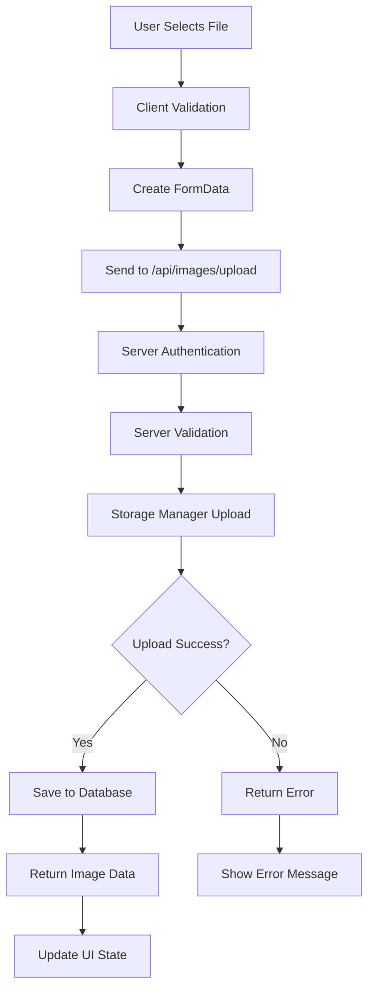
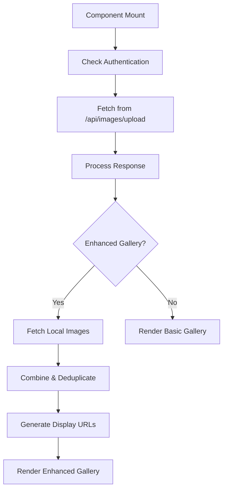

# Image Upload and Gallery System Documentation

## Overview

The Soar Yoga app features a comprehensive image upload and gallery system that allows users to upload, store, view, and manage yoga pose images. The system includes cloud storage with local fallback functionality, posture-specific image associations, and a robust user interface.

## Architecture

### Core Components

```
📁 app/clientComponents/imageUpload/
├── 🔧 Core Upload Components
│   ├── ImageUpload.tsx                    # Basic upload with dialog
│   ├── ImageUploadButton.tsx              # Simple button trigger
│   ├── ImageUploadComponent.tsx           # Standalone upload component
│   ├── ImageUploadWithFallback.tsx        # Cloud-first with local fallback
│   └── PostureImageUpload.tsx             # Posture-specific uploads
│
├── 🖼️ Gallery Components
│   ├── ImageGallery.tsx                   # Basic image gallery
│   ├── EnhancedImageGallery.tsx           # Advanced gallery with local/cloud sync
│   ├── PostureImageGallery.tsx            # Posture-filtered gallery
│   └── PostureImageManagement.tsx         # Combined upload + gallery for postures
│
├── 🎛️ Management Components
│   ├── ImageManagement.tsx                # Basic combined upload + gallery
│   ├── ImageManagementWithFallback.tsx    # Enhanced with fallback support
│   └── IntegrationExamples.tsx            # Usage examples and integrations
│
📁 lib/
├── imageService.ts                        # Core image operations
├── localImageStorage.ts                   # Browser local storage handling
└── storage/manager.ts                     # Cloud storage provider management

📁 app/api/images/upload/
└── route.ts                               # REST API endpoints (GET, POST, DELETE)
```

## Component Hierarchy & Usage

### 1. Basic Upload Components

#### `ImageUpload.tsx`

**Purpose**: Core upload component with dialog interface
**Features**:

- Drag & drop file selection
- File validation (type, size)
- Image preview
- Alt text input for accessibility
- Two variants: `button` (opens dialog) or `dropzone` (inline)

```tsx
<ImageUpload
  onImageUploaded={(image) => console.log('Uploaded:', image)}
  variant="dropzone"
  maxFileSize={10}
  acceptedTypes={['image/jpeg', 'image/png', 'image/webp']}
/>
```

#### `ImageUploadButton.tsx`

**Purpose**: Simple button that triggers upload dialog
**Features**:

- Material-UI button with upload icon
- Success notification snackbar
- Customizable appearance

```tsx
<ImageUploadButton
  variant="contained"
  onUploadSuccess={(imageData) => handleSuccess(imageData)}
/>
```

#### `ImageUploadWithFallback.tsx`

**Purpose**: Advanced upload with cloud-first, local fallback strategy
**Features**:

- Attempts cloud upload first
- Falls back to local storage if cloud fails
- Background sync when connection restored
- User notification of storage method used

```tsx
<ImageUploadWithFallback
  onImageUploaded={(image) => handleUpload(image)}
  variant="dropzone"
/>
```

### 2. Posture-Specific Components

#### `PostureImageUpload.tsx`

**Purpose**: Upload images associated with specific asana postures
**Features**:

- Associates images with posture ID or name
- Contextual alt text suggestions
- Same file validation and preview as basic upload

```tsx
<PostureImageUpload
  postureId="pose-warrior-1"
  postureName="Warrior I"
  onImageUploaded={(image) => handlePostureImage(image)}
  variant="dropzone"
/>
```

#### `PostureImageGallery.tsx`

**Purpose**: Display images filtered by specific posture
**Features**:

- Filters images by posture ID or name
- Grid layout with hover effects
- Click to zoom functionality
- Delete confirmation dialogs

```tsx
<PostureImageGallery postureId="pose-warrior-1" postureName="Warrior I" />
```

### 3. Gallery Components

#### `ImageGallery.tsx`

**Purpose**: Basic image gallery for user's uploaded images
**Features**:

- Responsive grid layout
- Image thumbnails with metadata
- Zoom dialog for full-size viewing
- Delete functionality
- Empty state with upload prompt

```tsx
<ImageGallery />
```

#### `EnhancedImageGallery.tsx`

**Purpose**: Advanced gallery with local/cloud image management
**Features**:

- Combines cloud and local storage images
- Visual indicators for storage type
- Sync local images to cloud
- Storage usage indicators
- Enhanced error handling

```tsx
<EnhancedImageGallery />
```

### 4. Combined Management Components

#### `ImageManagement.tsx`

**Purpose**: Tabbed interface combining upload and gallery
**Features**:

- Two-tab interface: Upload | Gallery
- Configurable variants: `full`, `upload-only`, `gallery-only`
- Auto-refresh gallery after uploads
- Customizable titles

```tsx
<ImageManagement
  title="My Yoga Poses"
  variant="full"
  showUploadButton={true}
  showGallery={true}
/>
```

#### `ImageManagementWithFallback.tsx`

**Purpose**: Enhanced management with fallback storage support
**Features**:

- All features of basic ImageManagement
- Local storage fallback
- Storage information dialog
- Cloud-first strategy indicators

```tsx
<ImageManagementWithFallback
  title="Pose Images"
  variant="full"
  showStorageInfo={true}
/>
```

#### `PostureImageManagement.tsx`

**Purpose**: Posture-specific image management
**Features**:

- Combines PostureImageUpload and PostureImageGallery
- Ensures all images are associated with specific posture
- Contextual interface messaging

```tsx
<PostureImageManagement
  title="Warrior I Images"
  postureId="pose-warrior-1"
  postureName="Warrior I"
  variant="full"
/>
```

## Data Flow Architecture

### Upload Process



### Gallery Fetch Process



## API Endpoints

### `POST /api/images/upload`

**Purpose**: Upload new image file
**Request**: FormData containing:

- `file`: Image file (required)
- `userId`: User ID (required)
- `altText`: Accessibility description (optional)
- `postureId`: Associated posture ID (optional)
- `postureName`: Associated posture name (optional)

**Response**:

```json
{
  "id": "cm123...",
  "url": "https://cloudflare.../image.jpg",
  "altText": "Warrior I pose demonstration",
  "fileName": "warrior-pose.jpg",
  "fileSize": 245760,
  "uploadedAt": "2025-01-15T10:30:00Z",
  "storageType": "CLOUD",
  "postureId": "pose-warrior-1",
  "postureName": "Warrior I"
}
```

### `GET /api/images/upload`

**Purpose**: Fetch user's uploaded images
**Query Parameters**:

- `limit`: Number of images to return (default: 10)
- `offset`: Pagination offset (default: 0)
- `postureId`: Filter by posture ID (optional)
- `postureName`: Filter by posture name (optional)

**Response**:

```json
{
  "images": [
    {
      "id": "cm123...",
      "url": "https://cloudflare.../image.jpg",
      "altText": "Warrior I pose",
      "fileName": "warrior.jpg",
      "fileSize": 245760,
      "uploadedAt": "2025-01-15T10:30:00Z",
      "postureId": "pose-warrior-1",
      "postureName": "Warrior I"
    }
  ],
  "total": 25,
  "hasMore": true
}
```

### `DELETE /api/images/upload?id={imageId}`

**Purpose**: Delete an image
**Response**: 204 No Content on success

## Storage Strategy

### Cloud-First Approach

1. **Primary Storage**: Cloudflare R2 (or configured cloud provider)
2. **Fallback Storage**: Browser localStorage/IndexedDB
3. **Sync Strategy**: Background upload when connection restored

### Storage Types

- **CLOUD**: Successfully uploaded to cloud storage
- **LOCAL**: Stored locally (cloud upload failed or offline)
- **HYBRID**: Available in both locations

### Fallback Behavior

1. User uploads image
2. System attempts cloud upload
3. If cloud fails:
   - Save to local storage
   - Mark as `LOCAL` type
   - Show user notification
   - Queue for background sync
4. When connection restored:
   - Auto-sync local images to cloud
   - Update storage type to `CLOUD`
   - Clean up local copies

## File Validation

### Client-Side Validation

- **File Types**: JPEG, PNG, WebP
- **File Size**: Maximum 10MB
- **Image Validation**: Ensures file is actually an image

### Server-Side Validation

- **Re-validation**: All client checks repeated on server
- **Authentication**: User must be logged in
- **Authorization**: Users can only manage their own images

## UI/UX Features

### Drag & Drop

- Visual feedback during drag operations
- Hover state changes
- File validation on drop

### Image Previews

- Thumbnail generation before upload
- Full-size zoom dialogs
- Fallback placeholder for broken images

### Responsive Design

- Mobile-optimized grid layouts
- Touch-friendly interactions
- Floating action buttons on mobile

### Accessibility

- Alt text input for all uploads
- Keyboard navigation support
- Screen reader compatible
- ARIA labels and roles

### Error Handling

- User-friendly error messages
- Retry functionality
- Graceful degradation when offline

## Integration Examples

### Profile Page Integration

```tsx
export function UserProfile() {
  return (
    <Box sx={{ p: 3 }}>
      <Typography variant="h4">My Profile</Typography>

      {/* Other profile content */}

      <ImageManagementWithFallback
        title="My Yoga Pose Images"
        variant="full"
        showStorageInfo={true}
      />
    </Box>
  )
}
```

### Posture Detail Page Integration

```tsx
export function PostureDetail({ postureData }) {
  return (
    <Paper>
      {/* Posture information */}

      <PostureImageManagement
        title={`Images for ${postureData.name}`}
        postureId={postureData.id}
        postureName={postureData.name}
        variant="full"
      />
    </Paper>
  )
}
```

### Quick Upload Integration

```tsx
export function QuickUpload() {
  return (
    <ImageUploadWithFallback
      onImageUploaded={(image) => console.log('Uploaded:', image)}
      variant="dropzone"
    />
  )
}
```

## Local Storage Management

### Browser Storage

- **Technology**: IndexedDB for large files, localStorage for metadata
- **Capacity**: Automatically checked and displayed to users
- **Cleanup**: Automatic cleanup after successful cloud sync

### Data Structure

```typescript
interface LocalImageData {
  id: string
  userId: string
  fileName: string
  dataUrl: string // Base64 encoded image
  altText?: string
  fileSize: number
  uploadedAt: string
  postureId?: string
  postureName?: string
  syncAttempts: number
  lastSyncAttempt?: string
}
```

### Sync Management

- **Background Sync**: Attempts upload when connection detected
- **Retry Logic**: Exponential backoff for failed uploads
- **User Control**: Manual sync trigger available
- **Status Indicators**: Visual feedback for sync state

## Performance Optimizations

### Image Optimization

- **Client Compression**: Reduce file size before upload
- **Thumbnail Generation**: Create optimized previews
- **Lazy Loading**: Load images only when visible
- **Progressive Loading**: Show placeholder while loading

### Data Management

- **Pagination**: Load images in chunks
- **Caching**: Local caching of cloud image metadata
- **Deduplication**: Prevent duplicate uploads
- **Cleanup**: Remove unused local storage

## Security Considerations

### Authentication

- **Required**: All operations require valid session
- **User Isolation**: Users can only access their own images
- **Token Validation**: Server-side session verification

### File Security

- **Type Validation**: Strict image type checking
- **Size Limits**: Prevent abuse with large files
- **Content Scanning**: Basic image validation
- **Storage Security**: Secure cloud storage configuration

### Privacy

- **User Data**: Images associated with user accounts only
- **Access Control**: Private by default
- **Deletion**: Complete removal from all storage locations

## Troubleshooting

### Common Issues

#### Upload Failures

- **Network Issues**: Automatic fallback to local storage
- **File Size**: Clear error message with size limit
- **File Type**: Specific guidance on supported formats
- **Authentication**: Redirect to login if session expired

#### Display Issues

- **Broken Images**: Automatic placeholder fallback
- **Loading States**: Skeleton loaders during fetch
- **Empty States**: Helpful prompts to encourage uploads

#### Storage Issues

- **Quota Exceeded**: Clear notification with usage info
- **Sync Failures**: Retry mechanism with user feedback
- **Local Storage Corruption**: Graceful error handling

### Debug Information

- **Console Logging**: Detailed logs for debugging
- **Error Tracking**: Comprehensive error reporting
- **Performance Monitoring**: Load time tracking
- **User Feedback**: Built-in error reporting

## Future Enhancements

### Planned Features

- **Image Editing**: Basic crop/rotate functionality
- **Bulk Operations**: Multi-select and batch actions
- **Search/Filter**: Find images by pose, date, or description
- **Sharing**: Share images with other users or publicly
- **Collections**: Organize images into custom collections
- **AI Tagging**: Automatic pose recognition and tagging

### Technical Improvements

- **Progressive Web App**: Better offline functionality
- **Background Sync**: More robust sync mechanisms
- **Image CDN**: Optimized delivery network
- **Advanced Caching**: Smarter cache management
- **Real-time Updates**: Live sync across devices

---

## Summary

The Soar Yoga app's image upload and gallery system provides a comprehensive, user-friendly solution for managing yoga pose images. With its cloud-first approach, local storage fallback, and posture-specific organization, it ensures users can always capture and access their yoga practice images regardless of network conditions.

The modular component architecture allows for flexible integration throughout the app, while the robust error handling and performance optimizations ensure a smooth user experience. The system is designed to scale with the application's needs while maintaining security and privacy standards.
